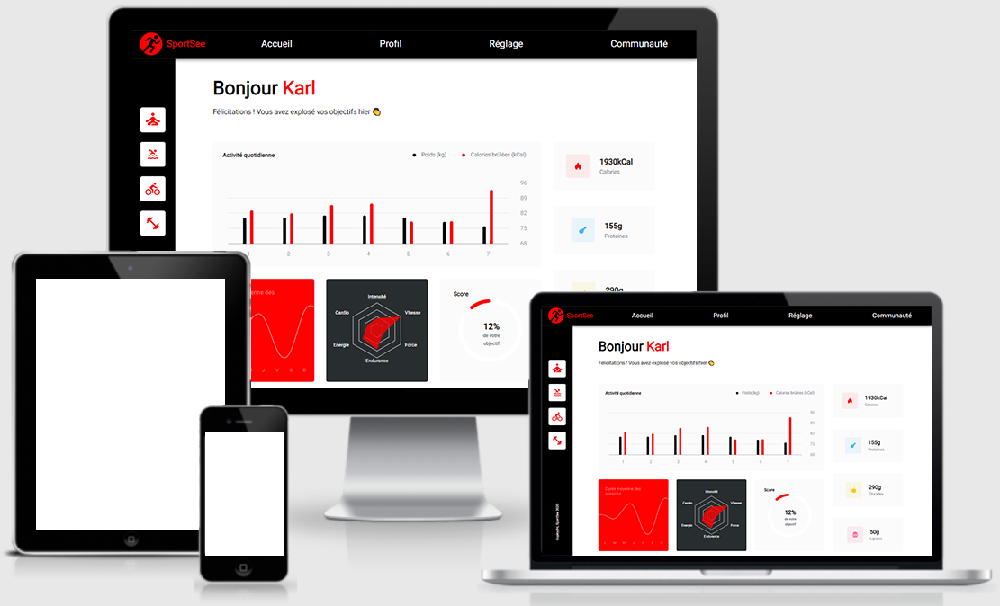

# Projet n°13 : Développer un tableau de bord d'analytics avec React partie back-end

## :mag: Aperçu

## :bookmark_tabs: Sommaire

<ol>
    <li><a href="#sujet">Sujet</a></li>
    <li><a href="#demandes_respecter">Demandes à respecter</a></li>
    <li><a href="#objectifs_projet">Objectifs du projet</a></li>
    <li><a href="#technologies_utilisees">Technologies utilisées</a></li>
    <li><a href="#prerequis">Prérequis</a></li>
    <li><a href="#installation">Installation</a></li>
    <li><a href="#utilisation_siteweb">Utilisation du site web</a></li>
    <li><a href="#auteurs_contributeurs">Auteurs et contributeurs</a></li>
    <li><a href="#licence">Licence</a></li>
</ol>

## :page_facing_up: 1. Sujet 

Vous travaillez en tant que développeur chez SportSee, une startup dédiée au coaching sportif.

En pleine croissance, l’entreprise va aujourd’hui lancer une nouvelle version de la page profil de l’utilisateur.

Cette page va notamment permettre à l’utilisateur de suivre le nombre de sessions réalisées ainsi que le nombre de calories brûlées.

## :memo: 2. Demandes à respecter 

- Développer l'application web en utilisant React et React Router ;
- Utiliser Recharts pour faire les graphiques ;
- Utiliser Fetch ou Axios pour la gestion des calls API ;
- Possibilité d'utiliser des données Mock et venant d'une API ;
- Utiliser les proptypes pour définir des contraintes sur l'utilisation des données ;
- L'application doit être responsive sur les écrans d’au moins 1024 par 780 pixels ;
- Respecter la maquette.

## :checkered_flag: 3. Objectifs du projet 

- Apprendre à utiliser React, React Router, Recharts, Fetch, Axios, et les proptypes.

## :computer: 4. Technologies utilisées 

- HTML
- CSS / Sass
- JavaScript / React.js
- Git & GitHub

## :exclamation: 5. Prérequis 

- Aucun

## :wrench: 6. Installation 

- Cloner ce repository.
- Pour installer les différents packages, dans le terminal à partir du dossier back-end, exécuter npm install.

## :question: 7. Utilisation du site web 

- Dans le terminal à partir du dossier back-end, exécuter npm run dev ;
- Suivre les indications d'utilisation pour le front-end ;
- L'application est disponible sur : http://localhost:4000/

## :beers: 8. Auteurs et Contributeurs 

Timoté Lancelle : [GitHub](https://github.com/LancelleTimote) / [LinkedIn](https://www.linkedin.com/in/timote-lancelle-devweb/)

## :page_with_curl: 9. Licence 

Distribué sous la licence MIT. Voir le fichier [LICENSE](LICENSE) pour plus d'informations.
